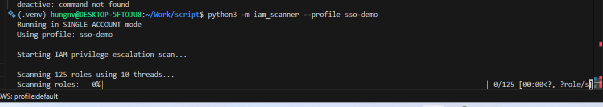
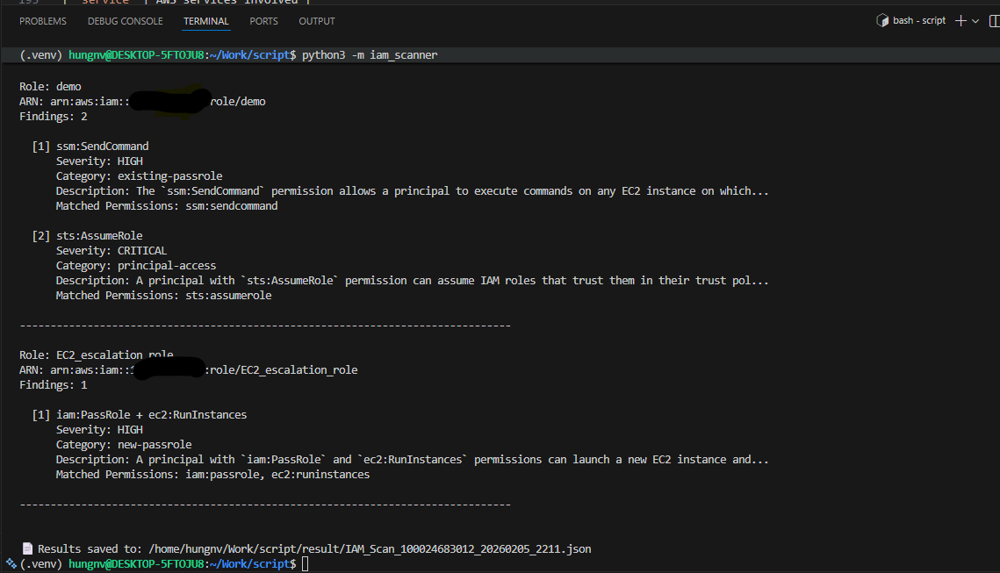
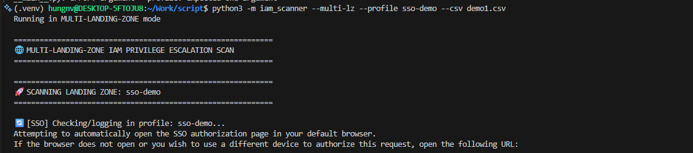

# IAM Privilege Escalation Scanner

A powerful multi-account AWS IAM privilege escalation vulnerability scanner that identifies potentially dangerous permission combinations across IAM roles and users.

## 📺 Demo






## 📊 Demo Result

### CSV Format

The CSV output provides a flattened view of all findings, perfect for quick analysis or importing into other tools.

| Column | Description |
|--------|-------------|
| `account` | AWS Account ID |
| `role` | Role or User name |
| `detect_policy` | Detected vulnerability pattern |
| `severity` | CRITICAL, HIGH, MEDIUM, or LOW |
| `category` | Finding category (e.g., existing-passrole, principal-access) |
| `service` | AWS services involved |

**Example Output:**
```csv
account,role,detect_policy,severity,category,service
01234567895,demo,ssm:SendCommand,HIGH,existing-passrole,"ssm, ec2"
01234567895,demo,sts:AssumeRole,CRITICAL,principal-access,sts
01234567895,EC2_escalation_role,iam:PassRole + ec2:RunInstances,HIGH,new-passrole,"iam, ec2"
```

### JSON Format

The JSON output provides detailed information including full descriptions of findings, matched permissions, and scan statistics.

**Example Output:**
```json
{
  "account_id": "xxxxxxxxx",
  "total_roles": 34,
  "scanned_roles": 8,
  "ignored_roles": 26,
  "vulnerable_roles": [
    {
      "role_name": "demo",
      "role_arn": "arn:aws:iam::xxxxxxxxx:role/demo",
      "findings": [
        {
          "pattern": "ssm:SendCommand",
          "category": "existing-passrole",
          "severity": "HIGH",
          "description": "The `ssm:SendCommand` permission allows a principal to execute commands on any EC2 instance on which they have this permission, using SSM Run Command....",
          "services": [
            "ssm",
            "ec2"
          ],
          "matched_permissions": [
            "ssm:sendcommand"
          ]
        },
        {
          "pattern": "sts:AssumeRole",
          "category": "principal-access",
          "severity": "CRITICAL",
          "description": "A principal with `sts:AssumeRole` permission can assume IAM roles that trust them in their trust policy...",
          "services": [
            "sts"
          ],
          "matched_permissions": [
            "sts:assumerole"
          ]
        }
      ],
      "total_permissions": 12
    }
  ],
  "ignored_role_details": [
    {
      "role_name": "AWSServiceRoleForConfig",
      "reason": "Standard Service Role (Trusted: config.amazonaws.com)"
    }
  ]
}
```


## 🎯 Overview

This scanner analyzes AWS IAM roles and users to detect privilege escalation paths and dangerous permission patterns based on known attack vectors. It supports both single account and multi-landing zone deployments with parallel scanning for optimal performance.

## ✨ Features

- 🔍 **Comprehensive Pattern Detection** - Detects 50+ privilege escalation patterns
- 🌐 **Multi-Landing Zone Support** - Scan across multiple AWS organizations and accounts
- ⚡ **Parallel Scanning** - Thread-based concurrent scanning for faster results
- 📊 **Multiple Output Formats** - JSON and CSV export options
- 🔐 **AWS SSO Integration** - Automatic SSO authentication handling
- 🎯 **Smart Filtering** - Ignores AWS service roles and managed service accounts
- 📁 **Organized Output** - Results automatically saved to `/result` folder
- 🚀 **Built for Scale** - Efficiently handles large multi-account environments

## 📋 Prerequisites

- Python 3.7+
- AWS CLI configured with appropriate credentials
- AWS SSO configured (for multi-landing zone mode)
- Required Python packages:
  - `boto3`
  - `tqdm` (optional, for progress bars)

## 🚀 Installation

```bash
# Clone the repository
git clone <repository-url>
cd Toolscanrole

# Create virtual environment
python3 -m venv .venv
source .venv/bin/activate

# Install dependencies
pip install boto3 tqdm
```

## 📂 Project Structure

```
iam_scanner/
├── config/              # Configuration files
│   ├── constants.py     # Application constants
│   ├── landing_zones.py # Landing zone configurations
│   └── patterns.py      # Privilege escalation patterns
├── scanners/            # Scanner implementations
│   ├── base_scanner.py  # Base scanner class
│   ├── role_scanner.py  # Role-specific scanning
│   └── user_scanner.py  # User-specific scanning
├── processors/          # Result processing
│   ├── result_processor.py    # Aggregates scan results
│   └── report_generator.py    # Generates reports (text/CSV)
├── multi_account/       # Multi-account scanning
│   ├── account_scanner.py     # Orchestrates multi-account scans
│   └── sso_handler.py         # AWS SSO authentication
└── __main__.py          # CLI entry point
```

## 🎮 Usage

### Multi-Landing Zone Mode (Recommended)

Scan across multiple AWS organizations and accounts:

```bash
python3 -m iam_scanner --multi-lz --profile sso-demo --csv demo1.csv
```

**Output:**
- `result/IAM_PrivEsc_Scan_YYYYMMDD_HHMM.json` - Detailed JSON results
- `result/IAM_PrivEsc_Scan_YYYYMMDD_HHMM.csv` - Flattened CSV report

### Single Account Mode

Scan a specific AWS account:

```bash
# Using AWS environment credentials (no profile needed)
export AWS_ACCESS_KEY_ID="your-access-key"
export AWS_SECRET_ACCESS_KEY="your-secret-key"
export AWS_SESSION_TOKEN="your-session-token"  # Optional, for temporary credentials
python3 -m iam_scanner  # Auto-saves to result/IAM_Scan_<account-id>_<timestamp>.json

# Using AWS profile
python3 -m iam_scanner --profile my-profile (Support SSO)

# Export to CSV
python3 -m iam_scanner --csv findings.csv

# Export both JSON and CSV with specific filenames
python3 -m iam_scanner --profile my-profile \
  --output results.json \
  --csv findings.csv
```

### Advanced Options

```bash
# Increase parallelization (Scan all landing zone and support multiple landing zone)
(you have the same permission set in all account to run in organize)
python3 -m iam_scanner --multi-lz --profile my-profile  --csv filename \
  --threads 20 \
  --account-workers 15

# Verbose output
python3 -m iam_scanner --profile my-profile --verbose
```

## ⚙️ Configuration


**Available Environment Variables:**

| Variable | Description | Default |
|----------|-------------|---------|
| `IAM_SCANNER_MULTI_LZ` | Enable multi-LZ mode (true/false) | `false` |
| `IAM_SCANNER_PROFILE` | AWS profile name | - |
| `IAM_SCANNER_REGION` | AWS region | - |
| `IAM_SCANNER_OUTPUT` | JSON output file path | - |
| `IAM_SCANNER_CSV` | CSV output file path | - |
| `IAM_SCANNER_THREADS` | Parallel scanning threads | `10` |
| `IAM_SCANNER_ACCOUNT_WORKERS` | Parallel account scans | `10` |
| `IAM_SCANNER_VERBOSE` | Verbose output (true/false) | `false` |
| `AWS_PROFILE` | Alternative AWS profile var | - |
| `AWS_REGION` | Alternative AWS region var | - |

**Priority:** Command-line arguments override environment variables.

**Using .env file:**

```bash
# Copy example file
cp .env.example .env

# Edit .env with your values
nano .env

# Variables are automatically loaded from environment
python3 -m iam_scanner
```

### Landing Zones Setup

Edit `iam_scanner/config/landing_zones.py`:

```python
LIST_LANDING_ZONES = [
    {
        "profile": "sso-demo",
        "permission_set": "AWSReadOnlyAccess",
        "account_file": "accounts_demo.txt"
    },
    {
        "profile": "sso-demo2",
        "permission_set": "AWSReadOnlyAccess",
        "account_file": "accounts_demo2.txt"
    }
]
```

### Account Lists

Create account list files (one account ID per line):

```
01234567895
01234567895
```


## 🔍 Detection Patterns

The scanner detects 50+ privilege escalation patterns including:

**IAM Service:**
- `iam:PutUserPolicy` - Attach inline policies to users
- `iam:CreatePolicyVersion` - Modify existing policies
- `iam:PassRole + *` - Pass privileged roles to services

**Lambda Service:**
- `iam:PassRole + lambda:CreateFunction`
- `lambda:UpdateFunctionCode`

**EC2 Service:**
- `ec2:ModifyInstanceAttribute` - Modify instance IAM roles
- `iam:PassRole + ec2:RunInstances`

**CloudFormation, CodeBuild, Glue, SageMaker, and more...**

See [`patterns.py`](iam_scanner/config/patterns.py) for the complete list.

## 🛡️ Smart Filtering

The scanner automatically ignores:

**Service Roles:**
- Roles that can only be assumed by AWS services
- AWS managed service-linked roles

**System Roles:**
- `AWSReservedSSO_*` roles
- `OrganizationAccountAccessRole`
- AWS service roles

**Service Accounts:**
- Users matching configured patterns
- Break-glass/emergency access accounts

## 🔧 Command-Line Options

```
Options:
  --multi-lz              Multi-landing-zone scan mode
  --profile PROFILE       AWS CLI profile (single account mode)
  --region REGION         AWS region
  --output FILE, -o FILE  JSON output file
  --csv FILE              CSV output file
  --verbose, -v           Verbose output
  --threads N, -t N       Parallel scanning threads (default: 10)
  --account-workers N     Parallel account scans (default: 10)
```

## 📈 Performance

- **Parallel Role Scanning:** 10 concurrent threads per account (configurable)
- **Parallel Account Scanning:** 10 concurrent accounts (configurable)
- **Typical Performance:** ~100-200 roles/minute depending on AWS API response times

## 🔒 Security Considerations

- **Read-Only Operations:** Scanner only performs read operations (IAM list/get calls)
- **No State Changes:** Does not modify any IAM configurations
- **Credential Safety:** Uses standard AWS credential chain (profiles, SSO)

## 🐛 Troubleshooting

**SSO Authentication Issues:**
```bash
# Manually login before scanning
aws sso login --profile your-profile
```

**Missing Dependencies:**
```bash
pip install boto3 tqdm
```

**Permission Errors:**
Ensure your IAM role/user has these permissions:
- `iam:ListRoles`
- `iam:GetRole`
- `iam:ListRolePolicies`
- `iam:GetRolePolicy`
- `iam:ListAttachedRolePolicies`
- `iam:GetPolicy`
- `iam:GetPolicyVersion`
- Same permissions for users (`iam:ListUsers`, etc.)

## 📝 Exit Codes

- `0` - Success, no vulnerabilities found
- `1` - Vulnerabilities detected
- `2` - Error during execution

## 🤝 Contributing

Contributions are welcome! Areas for improvement:
- Additional privilege escalation patterns
- Fillter IAM roles that False positive
- UI to show graph of IAM roles
- Enhanced filtering options
- Performance optimizations

## 👥 Author

hungnv003

## 🙏 Acknowledgments

Based on privilege escalation patterns from AWS security research and community findings.
